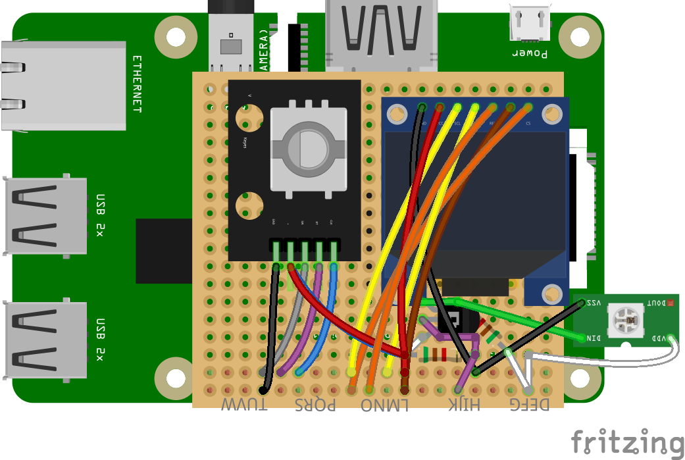
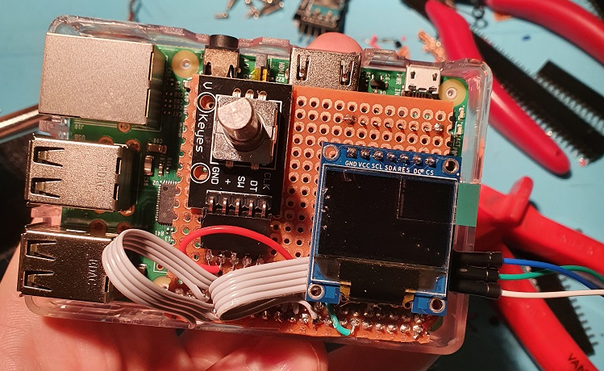

# Raspberry Pi LED server
This project will serve as an LED server that connects to external services through Ethernet and fetches data which can then be shown through the means of an LED light show.

## Hardware
* Raspberry Pi
* Neopixels
* A 96x64 pixel color SSD1331 OLED screen (for showing current LED mode and IP)
* Rotary Encoder (for setting brightness and changing LED mode)

## Prototype
The hardware prototype is done as a Fritzing design. I designed two custom parts in Inkscape for the *rotary encoder* and the *SSD1331 OLED screen*.

### Fritzing model

### After assembly
I used female headers for three things:

* Connecting to the Rasperry Pi male header
* Connecting to the breakout modules (rotary encoder and OLED)
* Giving mechanical support underneath the button (so that the board doesn't flex too much when the button is pressed)

