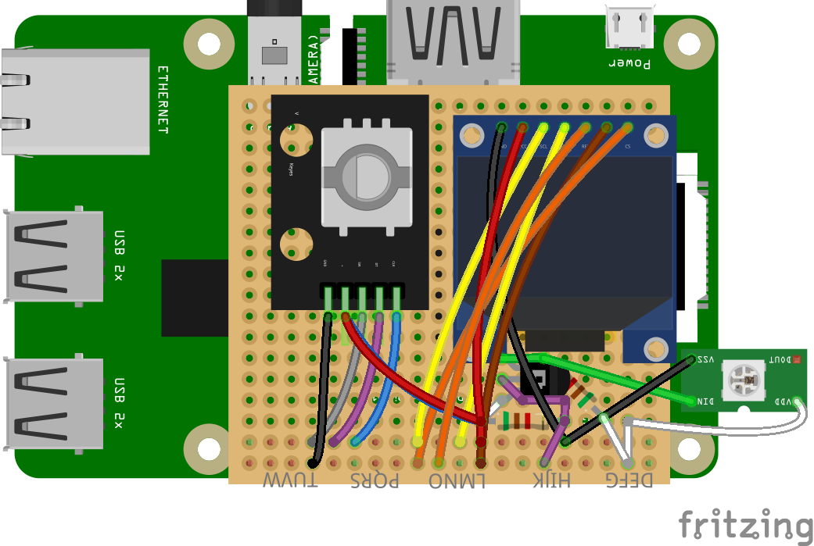
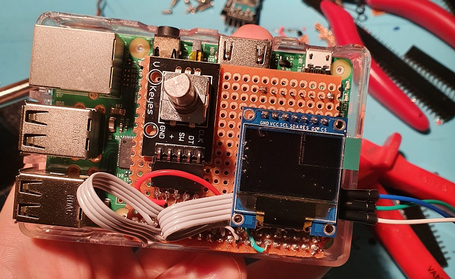

[](https://github.com/emanuelen5/rpi-led-server/actions/workflows/python.yml)

# Raspberry Pi LED server
This project will serve as an LED server that connects to external services through Ethernet and fetches data which can then be shown through the means of an LED light show.

## [Hardware](./doc/hardware.md)

* **Raspberry Pi**
  
  The compute platform

* **RGB LEDs**
  
  For displaying notifications

* **SSD1331 OLED screen**
  
  For showing current LED mode and IP

* **Rotary Encoder**
  
  For setting brightness and changing LED mode

### Fritzing model


### Assembled prototype


## [Application](./doc/application.md)

* **Display (controlled through Python C interface) that shows the current status**
* **Flask server (coming) that reacts to web requests**

## Installation

### Requirements
* Python 3.8

Library dependencies:
```bash
# Numpy
sudo apt-get install libatlas-base-dev
# OpenCV
sudo apt install -y libilmbase-dev libopenexr-dev libgstreamer1.0-dev
```

#### Additionally on Raspberry Pi:

Install the bcm2835 library:
```bash
# download the latest version of the library, say bcm2835-1.68.tar.gz
wget http://www.airspayce.com/mikem/bcm2835/bcm2835-1.68.tar.gz -O bcm2835.tar.gz
tar -zxvf bcm2835.tar.gz
cd bcm2835-1.??
./configure
make
sudo make check
sudo make install
```


### Installation steps
```bash
# Install dependencies
make init

# Build the C-library 
make liboled
```

### Run tests
```bash
make all # This both builds and runs all tests
```

### Run the applications
```bash
python main_oled.py # Draws some test strings
python rotary_encoder.py # Reacts to twisting and button presses
python main_leds.py # Runs a color wheel on the LEDs
python main.py # Combined application
```

#### Example usage

