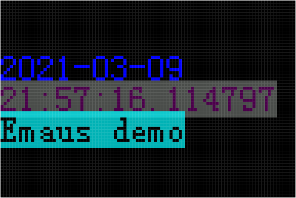

# Application

## [OLED driver](../oled/)
The core parts that communicate with the display hardware are written in C. They are compiled against the Python API so that they are callable from Python.

A mock implementation of the display has been written for testing on other targets. It renders the resulting frame buffer in an OpenCV window at a 6x scaling.

It can be run as: `python drawoled.py` and renders a similar window that displays the current time:

## Rotary encoder
A class that registers callbacks for rotation and button presses on the rotary encoder.

## LED driver
Just runs a color wheel on Neopixel compatible LEDs